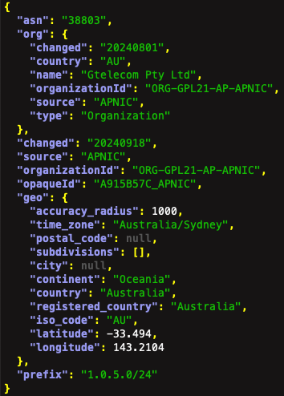

# MaxMind ASN Datapull

## Background
This repository is designed to pull the [MaxMind GeoLite ASN database](https://dev.maxmind.com/geoip/docs/databases/asn/), ASN referring to Autonomous System Numbers.  Splunk developed a custom module, [asparser](https://github.com/splunk/asparser), to download the data in json format.  This data can be used to enrich events with geolocation data.

## How It Works
This repository uses the [asparser](https://github.com/splunk/asparser) module to collect and normalize ASN datasets and enrich with Geolocation results.  The results are sent to Cribl via HEC and ultimately land and searchable in Splunk `(index=maxmind sourcetype="maxmind:asn")` (set in lines 42 & 43 of `send_to_cribl.py`).  This script can be easily be modified to send directly to Splunk as well via HEC.

## Prerequisites
* [Maxmind token (free but requires registration)](https://support.maxmind.com/hc/en-us/articles/4407111582235-Generate-a-License-Key) (stored as repository secret)
* Cribl/Splunk HEC endpoint (line 7 in `send_to_cribl.py`)
* Cribl/Splunk HEC token (stored as repository secret)

### Details & Sample Data
The pipeline can be configured to run daily.

Sample data is shown below:

### GitLab CI file
This repo was originally developed and running in GitLab, but now transitioned it to GitHub.  As such, I left the GitLab CI file for anyone who may want to use this in a GitLab environment.